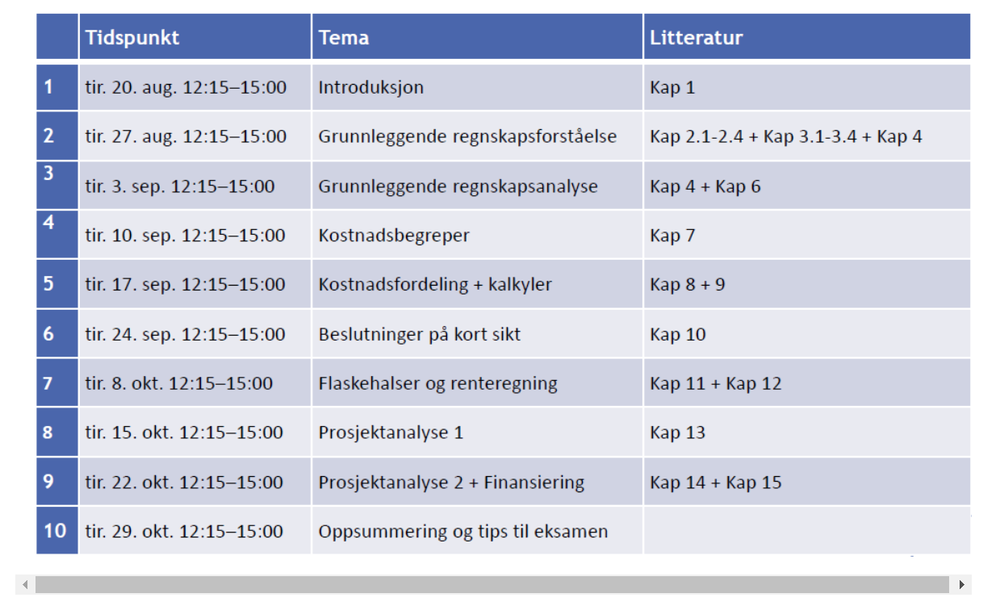

# HØKON1201 Bedriftsøkonomi
Dette faget gir en innføring i bedriftsøkonomisk teori og metode. Emnet er generelt og anvendelig for alle bransjer, med enkelte eksempler fra helsesektoren.

Temaer som vil bli behandlet er blant annet nøkkeltallsanalyse, kostnadsfordeling samt beslutninger på kort og lang sikt.

### **Forelesningsplan**

